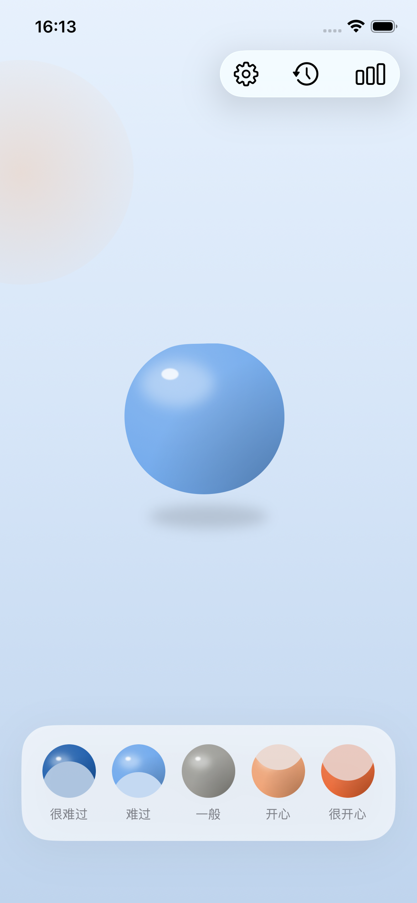
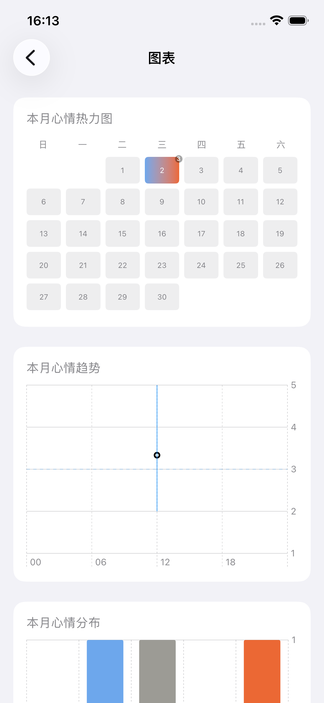

# MoodLock

一个把"记录一次心情"的操作成本压到几乎为零的 iOS 情绪自评 App —— 从锁屏或桌面小组件一点即可记录，不用先解锁、不用打开 App。

现有的心情记录类 App 大多需要打开 App、进入某个页面才能记录，操作步骤多，容易被遗忘或放弃。MoodLock 的定位很窄：先把"记录当下心情"这一步做到足够轻，再在数据积累后提供比现有产品更有洞察力的分析——这也是它和 Daylio、Bearable、苹果自带 State of Mind 这类产品的差异化方向。

完整的产品设计推导过程（包括被否决的方案和原因）见 [`PRD.md`](PRD.md)，是一份随开发持续更新的活文档，不是写完就不动的规格说明。

## 截图

| 主页 | 心情图表 |
| --- | --- |
|  |  |

## 功能

- **App 内 5 档心情记录**：月牙造型图标（两端细月牙、越靠近"一般"越饱满），双极配色（冷色系=负面、暖色系=正面、灰色=中性），本地 SwiftData 存储
- **锁屏 / 桌面小组件**：锁屏 3 档粗粒度（难过/一般/开心，受限于锁屏槽位尺寸和苹果 44pt 最小点击面积建议），桌面 Widget 完整 5 档，均通过 `AppIntent` 直接写入，不用打开 App
- **历史记录**：按日期分组的记录列表，支持补充文字备注、滑动删除
- **语音录音（可选）**：记录心情时可同步录音，事后可选择转文字归档或保留原始录音（`Speech` 框架，设备端识别）
- **本地异常检测**：60 秒内出现 ≥3 条、≥2 个不同档位的记录会被标记为疑似误触，仅在历史列表顶部给一条可划掉的被动提示，不阻断任何操作；10 分钟内同一档位的连续点击自动归并为一条记录，避免"反复点同一个按钮解压"污染数据
- **月度图表**：日历热力图（色块按"当天最低→最高档位"渐变，不用单一平均值掩盖情绪起伏）、趋势折线（每个点带当天高低范围的细竖线）、心情分布直方图、可选的心情时刻分布散点图，均用 Swift Charts 实现
- **情绪互动装置**：主页一个会跟随最近心情变色的软糖质感圆球，戳哪里哪里凹陷，松手带回弹——纯反馈/把玩层，不产生也不修改任何记录

明确不做：云同步/账号系统、社交分享、自动情绪/人脸识别、装饰性日记功能、通知提醒。

## 技术栈

- SwiftUI + SwiftData（数据模型与本地持久化）
- WidgetKit：`StaticConfiguration`（桌面 Widget）+ `AppIntentConfiguration`（锁屏单档可配置 Widget），App Intents 触发后台写入
- Swift Charts（热力图 / 趋势线 / 分布直方图 / 时刻散点图）
- AVFoundation（录音与回放）+ Speech（设备端语音转文字）
- App Group 共享容器，实现主 App 与 Widget 扩展之间的数据同步

## 项目结构

```
MoodLock/            主 App 目标（界面、录音、设置）
MoodLockWidget/       Widget 扩展目标（锁屏 + 桌面小组件、AppIntent）
Shared/               两个目标共用的代码（心情图标渲染、异常检测规则、App Group 常量）
PRD.md                产品需求文档，含完整的决策历史和变更记录
```

## 运行

- Xcode 16+，iOS 17.0+（依赖 iOS 17 起的交互式 Widget / `AppIntentConfiguration`）
- 打开 `MoodLock.xcodeproj`，选择 `MoodLock` scheme 在模拟器或真机上运行
- Widget 相关交互（尤其是震动反馈）建议用真机测试，模拟器支持有限

## 状态

MVP 开发中，按 [`PRD.md`](PRD.md) 第 12 节的顺序推进。当前还未完成的：App 图标设计、设置/历史/图表等二级页面的统一视觉规范改版。
